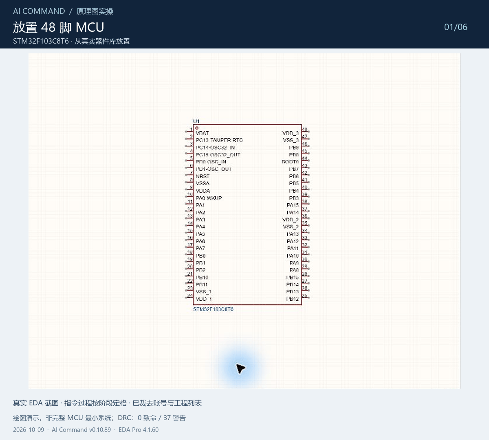
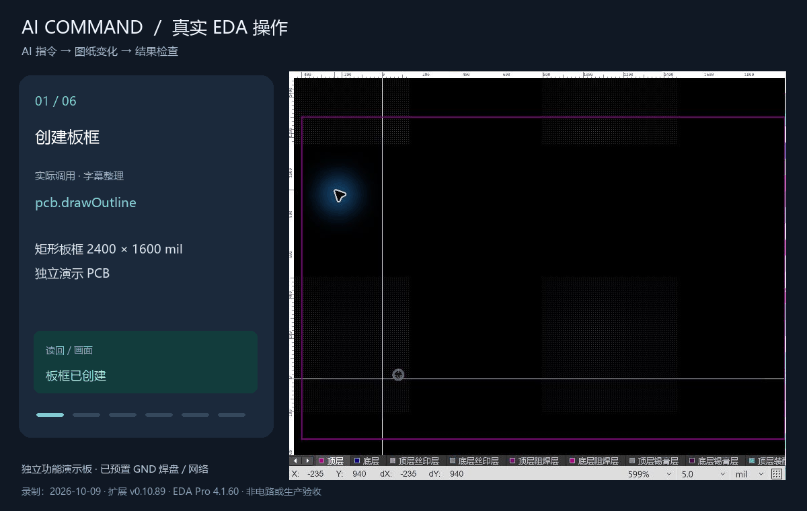

# EasyEDA AI Command

嘉立创 EDA 专业版的 AI 操作扩展：AI 按任务调用配套技能中的简明指令，由本地代理转发至已连接的 EDA 窗口，用于原理图、PCB、工程和元件库查询及编辑。具体操作仍需按项目目标检查结果并由使用者验收。

你可以向配套 AI 工具描述任务，例如“查一下这个芯片的库存和阶梯价”“把 PCB 上的元件按原理图功能区分组”“把这个符号和封装组合成我的库器件”“放置 MCU 和外围元件，接线并整理网络标签”。AI 会结合当前工程，查询器件和引脚、调用绘图指令，再读取执行结果。插件将**选料查询、自建器件库、批量绘图、PCB 功能区聚合和结果检查**整合到同一套操作流程中。

## 重点功能

### 1. 元器件库存、价格与可贴装物料查询

选料时即可查询嘉立创 SMT 物料的**元件编号、型号、封装、品牌、库存、参考单价和阶梯价格**，也支持按多个元件编号批量查询详情，方便比较候选器件的供货情况和采购数量对应的价格。

- **AI 查询**：让 AI 按关键词查找物料，或对一批料号查询库存、参数描述和阶梯报价。
- **独立查询窗口**：通过插件菜单打开 SMT 物料查询页面，直接查看查询结果。
- **结合绘图选料**：配合器件库搜索与按立创编号放置器件，把查询到的候选型号用于后续原理图绘制。

库存与价格来自嘉立创开放平台的查询结果，具体以平台当次返回和下单时信息为准；参考单价不等于所有采购数量的成交价。此功能需单独配置开放平台凭据，见[物料查询配置](https://github.com/quhuii-lgtm/easyeda-aicommand/blob/main/docs/QUICKSTART.md#5-可选-smt-物料查询)。普通绘图功能不需要这组凭据。

### 2. PCB 按原理图功能区聚合与初步排布

把原理图中已用矩形区框划分的“电源”“MCU”“驱动”“接口”等功能区，转换成 PCB 上对应的器件分组。插件读取区框和器件归属，将同一功能区的器件聚合排布，并生成组边框和组名，便于从分散的器件开始整理布局。

- 整合了 PCB 元件聚合能力，布局引擎移植自官方 `eext-pcb-component-grouping`，可由 AI 直接调用。
- 支持跨图页读取功能区，也可指定图页；组内按器件类别分行，组间分区排列。
- **先预览再执行**：默认返回分组与位置方案；实际执行时检查板框范围、避让已有器件，并做写入前备份和位置读回核对。

适合原理图导入 PCB 后的功能区归组和初步排布。需要先在原理图中建立功能区框；聚合完成后仍需结合去耦、回流、散热、射频和机械要求继续调整，不等同于完成最终布局或自动布线。

### 3. 自建器件库：符号、封装与完整器件管理

除了使用现有商城器件，也能通过 AI 管理自己的符号库、封装库和器件库，把项目中需要的自定义元件保存下来，供后续工程复用。库操作默认面向个人库，也可指定有权限访问的目标库。

- **创建与编辑符号、封装**：新建库条目、打开对应编辑器，并将编辑后的符号或封装内容写回库中。
- **组合完整器件**：把已有原理图符号与 PCB 封装关联成器件，可同时绑定已有 3D 模型，并设置位号前缀、制造商、供应商及 BOM、转 PCB 属性。
- **复制与派生型号**：将已有符号、封装或器件复制到指定库并另命名，便于在现有资料基础上维护自己的版本。
- **查询与维护**：搜索、读取、修改或删除库条目，调整器件的符号和封装关联，维护常用元件资料。

例如，将已绘制的专用连接器符号和已核对尺寸的封装组合成自有器件，后续按该库器件放入原理图。创建库条目不等于自动完成引脚和封装设计，实际使用前仍需核对引脚编号、焊盘对应关系与尺寸；绑定 3D 模型也不代表自动生成模型。

### 4. 从器件清单与连接关系批量画原理图

支持按立创料号放置器件、读取实际引脚、修改位号与属性，以及批量创建功能区。AI 可以依据器件清单和连接关系，分步骤完成放置、连接、命名和检查，减少重复的查找、点击和输入。

已有原理图也可按指定器件或区域预览整理方案，再执行重排和连线重建。适合重复通道、MCU 外围、接口模块等具有明确连接关系的绘制任务。

### 5. 批量连线、网络标签与连接核对

提供引脚间直连、短线加网络标签，以及混合批量连线。支持网络标签命名和整理、引脚非连接标记、网络成员查询与网表导出。

连线时可依据真实引脚位置处理路径，标签创建后核对是否实际附着到导线；批量连线会检查网表中的连接结果。这样既能生成整齐的图面，也能进一步确认“这些引脚是否真正进入同一个网络”。下方 MCU 演示展示了短线引出、左右标签对齐及保存重开核对。

### 6. PCB 绘制、铺铜与网络管理

支持板框绘制、器件移动与旋转、按坐标生成走线、放置过孔、创建和修改铺铜区域，以及重建铺铜后读取填充状态。还可管理网络类、差分对，查询网络长度、读取网络上的走线和焊盘，并通过高亮或原理图与 PCB 联动定位辅助排查。

适合按明确规则执行成批操作，例如“按这些坐标布线”“给指定区域建立 GND 铺铜并重建”“把这组信号加入网络类”。外部自动布线流程可使用 DSN 导出与 SES 导入衔接，布线结果仍需检查。

### 7. 工程检查、资料导出与多窗口操作

- **结果检查**：读取器件、引脚、导线、标签和铺铜状态；运行原理图及 PCB DRC，并导出网表核对连接。检查明细的可用程度取决于 EDA 宿主版本。
- **资料导出**：支持 BOM、原理图图片、PCB Gerber、贴片坐标等，便于整理设计资料与后续制造交付。
- **多窗口定位**：通过实例和文档身份指定操作目标，适用于同时打开多个工程的工作场景。
- **组合操作**：宏指令可将放器件、连线、检查等步骤串起来，按顺序执行并返回各步结果；遇到写入结果不确定时停止依赖它的后续操作。

这些能力由本地代理和配套 AI 技能协同使用。插件提供工程操作与结果读取，电路方案和最终验收仍需结合实际项目要求。

### 8. 嘉立创下单检查（DFM）

提供 PCB DFM、SMT 和同网间距检查，分别返回 18、7、1 项结果，并保留完整性和几何覆盖信息。运行 DFM 时必须明确输入外层铜厚 `outerCopperOz` 与内层铜厚 `innerCopperOz`；图纸读取到的铜厚单独报告，不能代替输入值。结果不等于制造放行，也不代表完整在线 DFM 服务。详见[下单检查说明](skills/ai-command-engine/references/commands-dfm.md)。

### 9. 焊盘扇出与自动局部铜皮

`pcb.getFanoutPlan` 和 `pcb.getAutoCopperPlan` 先生成只读计划；`pcb.fanout` 与 `pcb.autoCopper` 按完整计划执行。扇出线长、线宽、过孔外径、孔径和安全间距都须以 mil 明确输入。几何支持范围、保守近似和拒绝条件见[几何命令说明](skills/ai-command-engine/references/commands-geometry.md)。相关几何功能目前只有本地回归和算法对照，尚未在真实 EDA 工程验证写入或保存重开。

## 实际操作演示

以下动画录制于扩展 v0.10.89、EDA Pro 4.1.60，展示既有操作能力，不是 v0.10.93 的实机验收记录。

### 原理图：多脚 MCU、外围元件、短连线与标签



实际绘制 STM32F103C8T6 和 6 个外围元件，用短直线连接复位、BOOT0 支路，其余引脚用等长短线引出，最后将网络标签分列对齐。保存重开后，**57 个标签均已附着，60 个引脚网络成员保持一致**。这是绘图功能演示，非完整 MCU 最小系统；本次 DRC 为 0 个致命错误、37 条警告。录制环境为扩展 v0.10.89、EDA Pro 4.1.60；[步骤和验证说明](docs/DEMO-SCHEMATIC.md)。

### PCB：板框、走线、过孔与铺铜



在独立演示 PCB 中，AI 依次调用指令创建板框、绘制顶层走线、放置过孔并接续底层走线、创建并重建铺铜，最后保存、关闭、重开并读取结果。重开后读回 **6 段走线，铺铜状态为已填充**。

画面来自真实 EDA 操作截图，指令说明为后期字幕，已裁去账号和工程列表。演示预先建立了 GND 焊盘与网络；它是功能演示板，不是完整电路设计。录制环境为 **2026-10-09、扩展 v0.10.89、EDA Pro 4.1.60**，验证范围限于下述演示对象。动画约 18 秒，详细步骤及验证范围见 [演示说明](docs/DEMO.md)。

## 安装前准备

**使用时必须另外安装 Node.js >=20.17.0、本地指令代理和 AI 技能。**从插件市场安装扩展本身不会安装或启动代理，也不会替你安装技能。扩展启用后还需在 EDA 中允许外部交互，并由使用者启动本地代理、安装对应技能及核对连接目标。

扩展、代理和 AI 技能是分别安装的组成部分。代理默认在本机运行，默认地址为 `http://127.0.0.1:49720`。可选的问题上报工具可整理必要问题信息，使用本机 [GitHub CLI](https://cli.github.com/) 登录身份提交 GitHub Issue；提交前由 AI 告知使用者。问题上报不会由 EDA 指令自动触发，也不会在后台上传工程数据。

## 版本状态

**v0.10.93 是 2026-10-09 的预发布候选。**开发目录的 104 份冻结文件核对通过，本地回归与安装包核对已完成；尚未安装真实 EDA，也未在真实 PCB 工程验证几何写入、保存关闭重开和整板 DRC。市场错误 `103014`（“entry 不能为空”）是否已解决尚未验证，GitHub 发布也不代表市场审核通过。详见 [v0.10.93 版本说明](docs/releases/v0.10.93.md)。

页面展示的“小机器人画电路板”图标是项目 Logo；市场发布图标文件为 `images/logo-marketplace.png`。

## v0.10.93 下载与安装

本预发布版本的扩展包、技能包、校验文件和源码包均按 tag `v0.10.93` 获取：

- [扩展包 ai-command-engine_v0.10.93.eext](https://github.com/quhuii-lgtm/easyeda-aicommand/releases/download/v0.10.93/ai-command-engine_v0.10.93.eext)
- [配套技能包 ai-command-engine-skill_v0.10.93.zip](https://github.com/quhuii-lgtm/easyeda-aicommand/releases/download/v0.10.93/ai-command-engine-skill_v0.10.93.zip)
- [SHA256SUMS.txt](https://github.com/quhuii-lgtm/easyeda-aicommand/releases/download/v0.10.93/SHA256SUMS.txt)
- [v0.10.93 源代码 ZIP](https://github.com/quhuii-lgtm/easyeda-aicommand/archive/refs/tags/v0.10.93.zip)

技能 ZIP 解压后，将 `ai-command-engine/` 整个目录安装到所用 AI 工具的技能目录，保留 `references/` 和脚本等子目录，不能只复制 `SKILL.md`。源码 ZIP 中的技能位于 `skills/ai-command-engine/`。代理不单独打包；下载源码 ZIP 后，按[安装与使用指南](docs/QUICKSTART.md)安装 Node.js 依赖并运行本地代理。扩展、代理和技能分别安装，扩展市场不会替使用者安装代理或技能。

## 首次使用

请按[安装与使用指南](https://github.com/quhuii-lgtm/easyeda-aicommand/blob/main/docs/QUICKSTART.md)完成 Node.js 与代理依赖、EDA 扩展安装、外部交互授权、首次只读验证和 AI 技能安装。要运行代理，请在仓库目录执行：

```powershell
git clone https://github.com/quhuii-lgtm/easyeda-aicommand.git
Set-Location easyeda-aicommand
npm ci
node bridge/command-proxy.mjs
```

ZIP 用户在解压后的仓库目录运行 `npm ci` 和 `node bridge/command-proxy.mjs`。保留代理终端，再从 [Releases](https://github.com/quhuii-lgtm/easyeda-aicommand/releases) 下载 `.eext`，在 EDA 插件管理界面导入、启用并允许外部交互。然后将完整的 [`skills/ai-command-engine/`](https://github.com/quhuii-lgtm/easyeda-aicommand/tree/main/skills/ai-command-engine) 安装到 AI 工具的技能目录，并在 EDA 菜单点击 AI Command → 启动桥接。安装扩展不会在本机部署代理或向 AI 工具安装技能；完整步骤见[首次使用指南](https://github.com/quhuii-lgtm/easyeda-aicommand/blob/main/docs/QUICKSTART.md)。

Windows 提供可选的 URL 协议启动方式；注册和生命周期说明见[桥接生命周期文档](https://github.com/quhuii-lgtm/easyeda-aicommand/blob/main/docs/BRIDGE-LIFECYCLE.md)。普通调用不需要 GitHub CLI；只有选择使用可选的问题上报功能时才需要它。SMT 物料查询另需[嘉立创开放平台](https://open.jlc.com)凭据，配置见[物料查询指南](https://github.com/quhuii-lgtm/easyeda-aicommand/blob/main/docs/QUICKSTART.md#5-可选-smt-物料查询)。

## 安全与验证边界

- 每条 `/command` 请求都须携带顶层 `instanceId`；先查询连接并核对目标窗口。图页操作还要确认页身份。
- 写入超时不表示操作已取消；遇到未知结果或写保护时先只读核实，不要盲目重试。
- 插件/API 返回、保存读回、关闭后重开读回和生产验收代表不同证据。命令成功、DRC 或模拟回归都不能单独证明电路正确。
- 问题上报只使用已取得且可公开的必要证据。提交前需告知使用者；GitHub CLI、Issue 创建和登录都是可选流程。提交入口见[GitHub Issues](https://github.com/quhuii-lgtm/easyeda-aicommand/issues)。

## 开发者资料

源码、代理与完整 AI 技能见[仓库](https://github.com/quhuii-lgtm/easyeda-aicommand)。本地回归、构建、宿主验证等信息会在对应版本说明中分别标明。项目更新记录见 [CHANGELOG](https://github.com/quhuii-lgtm/easyeda-aicommand/blob/main/CHANGELOG.md)，构建框架历史见 [SDK changelog](https://github.com/quhuii-lgtm/easyeda-aicommand/blob/main/docs/SDK-CHANGELOG.md)。

[Apache-2.0 许可](https://github.com/quhuii-lgtm/easyeda-aicommand/blob/main/LICENSE)。
